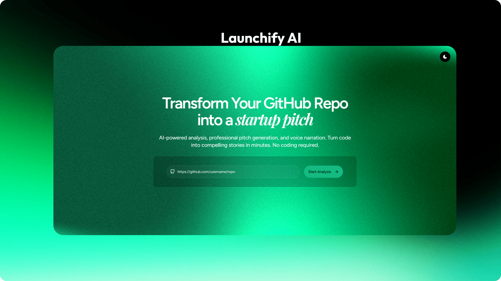

# Launchify AI



🎥 **Watch Demo Video:**  
[▶️ Click here to watch on YouTube](https://youtube.com/YOUR_VIDEO_LINK_HERE)

**Transform your GitHub repository into a compelling startup pitch in seconds.**

Launchify AI analyzes your code, understands your project's value proposition, and generates a professional startup pitch complete with voice narration and multi-language support. Turn your side projects into investable stories without writing a single word of copy.

## Features

- **Deep Code Analysis**: Uses **Google Gemini 1.5/2.0** to scan your repository, understanding your tech stack, architecture, and core features.
- **Visual Pitch Workflow**: Interactive node-based canvas built with **ReactFlow** to visualize the pitch generation process.
- **multilingual Support**: Integrated with **Lingo.dev** to translate your pitch into Spanish, French, Japanese, Hindi, and German.
- **Professional Voiceovers**: Converts your pitch into high-quality audio narration using **ElevenLabs'** advanced text-to-speech engine.
- **Instant Pitch Generation**: Automatically creates a structured startup pitch script covering the Problem, Solution, Market, and Business Model.
- **Dynamic UI**: A beautiful, interactive interface built with **Next.js 16** and **Tailwind CSS**.

## Tech Stack

- **Framework**: [Next.js 16](https://nextjs.org/) (App Router & Turbopack)
- **Language**: [TypeScript](https://www.typescriptlang.org/)
- **Styling**: [Tailwind CSS v4](https://tailwindcss.com/)
- **AI Engineer**: [Gemini 1.5 Flash](https://deepmind.google/technologies/gemini/)
- **Localization**: [Lingo.dev](https://lingo.dev/)
- **Workflow Visualization**: [ReactFlow](https://reactflow.dev/)
- **Voice AI**: [ElevenLabs](https://elevenlabs.io/)
- **Components**: [Shadcn UI](https://ui.shadcn.com/)
- **State Management**: [Zustand](https://github.com/pmndrs/zustand)
- **Icons**: [Lucide React](https://lucide.dev/)

## Getting Started

### Prerequisites

- Node.js 18+
- npm, pnpm, or bun
- API Keys for:
  - **Google Gemini**
  - **ElevenLabs**
  - **Lingo.dev**

### Installation

1.  **Clone the repository**

    ```bash
    git clone https://github.com/yourusername/launchify-ai.git
    cd launchify-ai
    ```

2.  **Install dependencies**

    ```bash
    npm install
    # or
    pnpm install
    ```

3.  **Set up environment variables**

    Create a `.env` file in the root directory and add your API keys:

    ```env
    # AI Configuration
    GEMINI_API_KEY=your_gemini_key_here

    # Voice Configuration
    ELEVENLABS_API_KEY=your_elevenlabs_key_here

    # Localization Configuration
    LINGODOTDEV_API_KEY=your_lingo_key_here
    ```

4.  **Run the development server**

    ```bash
    npm run dev
    ```

    Open [http://localhost:3000](http://localhost:3000) with your browser to see the result.

## Usage

1.  **Enter Repo URL**: Paste the URL of a public GitHub repository (e.g., `https://github.com/facebook/react`) on the landing page.
2.  **Start Analysis**: Click the button to let the AI scan the codebase.
3.  **Visual Workflow**: Watch as the application builds a node graph representing your repository, pitch generation, translation, and audio synthesis.
4.  **View & Listen**: Read the generated pitch, switch languages, and listen to the professional narration.

## Contributing

Contributions are welcome! Please feel free to submit a Pull Request.

1.  Fork the Project
2.  Create your Feature Branch (`git checkout -b feature/AmazingFeature`)
3.  Commit your Changes (`git commit -m 'Add some AmazingFeature'`)
4.  Push to the Branch (`git push origin feature/AmazingFeature`)
5.  Open a Pull Request

## License

This project is licensed under the MIT License.
